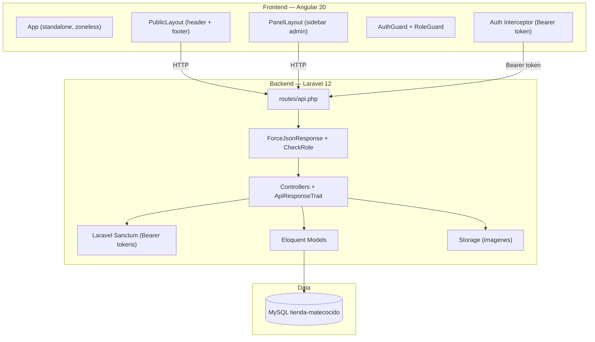

# Codebase Map — Tienda Matecocido

> Migrado a Laravel 12 + Angular 20. Last mapped: 2026-02-25

## System Overview

E-commerce de productos de ceramica artesanal. Backend Laravel 12 con Sanctum auth, frontend Angular 20 con PrimeNG. Base de datos MySQL sobre XAMPP.



## Directory Structure

```
tienda-matecocido/
├── api/                              # Laravel 12 Backend
│   ├── app/
│   │   ├── Enums/
│   │   │   └── Role.php              # enum Role: ADMIN, CLIENTE
│   │   ├── Http/
│   │   │   ├── Controllers/
│   │   │   │   ├── AuthController.php        # registro, login, logout, me, cambiarPassword
│   │   │   │   ├── ProductoController.php    # CRUD + image upload
│   │   │   │   ├── CategoriaController.php   # CRUD
│   │   │   │   ├── ColorController.php       # CRUD
│   │   │   │   ├── OrdenController.php       # CRUD + cambiarEstado
│   │   │   │   ├── UsuarioController.php     # index, show, toggleActivo
│   │   │   │   └── HealthController.php      # DB liveness
│   │   │   ├── Middleware/
│   │   │   │   ├── ForceJsonResponse.php     # Force Accept: application/json
│   │   │   │   └── CheckRole.php             # Verifica rol del usuario
│   │   │   └── Traits/
│   │   │       └── ApiResponseTrait.php      # Envelope {success, message, content}
│   │   └── Models/
│   │       ├── Usuario.php                   # HasApiTokens, custom getAuthPassword
│   │       ├── Producto.php                  # belongsToMany categorias/colores
│   │       ├── Categoria.php
│   │       ├── Color.php
│   │       ├── ProductoImagen.php
│   │       ├── DatosPersonales.php
│   │       ├── Orden.php                     # hasMany detalles, belongsTo usuario
│   │       ├── DetalleOrden.php
│   │       └── BaseModel.php                 # Shared table config
│   ├── bootstrap/app.php             # Middleware + exception handlers
│   ├── config/
│   │   ├── cors.php                  # CORS_ALLOWED_ORIGINS from .env
│   │   └── auth.php                  # Provider: Usuario model
│   ├── routes/api.php                # 34 REST endpoints
│   ├── storage/app/public/productos/ # Product images
│   └── .env                          # DB, Sanctum, CORS config
│
├── front-angular/                    # Angular 20 Frontend
│   ├── src/
│   │   ├── app/
│   │   │   ├── app.ts                # Root component (standalone)
│   │   │   ├── app.config.ts         # Providers: zoneless, router, HttpClient, PrimeNG Aura
│   │   │   ├── app.routes.ts         # All routes (lazy-loaded)
│   │   │   ├── core/
│   │   │   │   ├── guards/
│   │   │   │   │   ├── auth.guard.ts
│   │   │   │   │   └── role.guard.ts
│   │   │   │   ├── interceptors/
│   │   │   │   │   └── auth.interceptor.ts   # Bearer token + 401 redirect + loading
│   │   │   │   └── services/
│   │   │   │       ├── auth.service.ts       # Login, registro, session management
│   │   │   │       ├── cart.service.ts       # BehaviorSubject + localStorage
│   │   │   │       ├── loading.service.ts    # Request counter for spinner
│   │   │   │       ├── productos.service.ts
│   │   │   │       ├── categorias.service.ts
│   │   │   │       ├── colores.service.ts
│   │   │   │       ├── ordenes.service.ts
│   │   │   │       └── usuarios.service.ts
│   │   │   └── features/
│   │   │       ├── layouts/
│   │   │       │   ├── public-layout/        # Header + RouterOutlet + Footer
│   │   │       │   └── panel-layout/         # Sidebar + RouterOutlet (admin)
│   │   │       ├── common/
│   │   │       │   ├── header/               # Navbar + categories + cart badge
│   │   │       │   ├── footer/
│   │   │       │   ├── spinner/
│   │   │       │   └── not-found/
│   │   │       ├── home/home/                # Landing page
│   │   │       ├── tienda/
│   │   │       │   ├── producto-list/        # Product grid + category filter
│   │   │       │   └── producto-detail/      # Detail + add to cart
│   │   │       ├── cart/
│   │   │       │   ├── cart/                 # Cart view
│   │   │       │   └── checkout/             # Checkout form
│   │   │       ├── auth/
│   │   │       │   ├── auth.routes.ts
│   │   │       │   └── pages/login/ register/
│   │   │       └── dashboard-admin/
│   │   │           ├── resumen/              # Stats + recent orders
│   │   │           ├── productos/            # p-table + producto-form (CRUD)
│   │   │           ├── categorias/           # p-table + p-dialog CRUD
│   │   │           ├── colores/              # p-table + p-dialog CRUD
│   │   │           ├── ordenes/              # p-table + detail/estado dialogs
│   │   │           └── usuarios/             # p-table + toggle activo
│   │   ├── environments/
│   │   │   ├── environment.ts        # apiUrl: http://127.0.0.1:8000/api
│   │   │   └── environment.prod.ts   # apiUrl: /api
│   │   └── styles.scss               # Bootstrap grid + PrimeIcons + brand vars
│   ├── angular.json
│   └── package.json                  # Angular 20, PrimeNG 20, Bootstrap 5
│
├── db/
│   ├── tienda-matecocido.sql         # Original DDL + seed data
│   └── migration-v2.sql              # Migration: FKs, ordenes, bcrypt, DECIMAL
│
├── postman/                          # Postman collection
├── docs/
│   ├── CODEBASE_MAP.md               # This file
│   └── PLAN_MIGRACION.md             # Migration plan (completed)
└── CLAUDE.md                         # Project instructions
```

## API Routes

### Public (no auth)
| Method | Path | Controller |
|--------|------|-----------|
| GET | `/health` | HealthController@index |
| GET | `/productos` | ProductoController@index |
| GET | `/productos/{codigo}` | ProductoController@show |
| GET | `/categorias` | CategoriaController@index |
| GET | `/colores` | ColorController@index |

### Auth
| Method | Path | Controller |
|--------|------|-----------|
| POST | `/auth/registro` | AuthController@registro |
| POST | `/auth/login` | AuthController@login |
| POST | `/auth/logout` | AuthController@logout |
| GET | `/auth/me` | AuthController@me |
| PUT | `/auth/cambiar-password` | AuthController@cambiarPassword |

### Protected (auth:sanctum)
| Method | Path | Controller |
|--------|------|-----------|
| POST | `/ordenes` | OrdenController@store |
| GET | `/ordenes/mis-ordenes` | OrdenController@misOrdenes |

### Admin (auth:sanctum + role:ADMIN)
| Method | Path | Controller |
|--------|------|-----------|
| GET/POST | `/admin/productos` | ProductoController@index/store |
| PUT/DELETE | `/admin/productos/{id}` | ProductoController@update/destroy |
| GET/POST | `/admin/categorias` | CategoriaController |
| PUT/DELETE | `/admin/categorias/{id}` | CategoriaController |
| GET/POST | `/admin/colores` | ColorController |
| PUT/DELETE | `/admin/colores/{id}` | ColorController |
| GET | `/admin/ordenes` | OrdenController@index |
| GET/PATCH | `/admin/ordenes/{id}` | OrdenController@show/cambiarEstado |
| GET | `/admin/usuarios` | UsuarioController@index |
| GET/PATCH | `/admin/usuarios/{id}` | UsuarioController@show/toggleActivo |

## Database Schema

12 tables + 2 new (ordenes, detalle_ordenes) + personal_access_tokens (Sanctum):

- **usuarios**: id_usuario, email (UNIQUE), clave (bcrypt), id_rol FK, activo, timestamps
- **roles**: id_rol, nombre (ADMIN, CLIENTE)
- **productos**: id_prod, codigo (UNIQUE), nombre, descripcion, precio DECIMAL(10,2), stock, activo, timestamps
- **categorias**: id_categ, codigo (UNIQUE), nombre, activo
- **colores**: id_color, codigo (UNIQUE), nombre, path_img, activo
- **productos_categorias**: pivot with FKs
- **productos_colores**: pivot with FKs
- **productos_imagenes**: id_img_prod, id_prod FK, path_img, nombre
- **datos_personales**: id_datos, id_usuario FK, nombre, apellido, telefono, direccion
- **ordenes**: id_orden, id_usuario FK, total, estado ENUM, nombre/direccion/telefono_envio, notas, activo, timestamps
- **detalle_ordenes**: id_detalle, id_orden FK, id_prod FK, cantidad, precio_unitario, subtotal
- **personal_access_tokens**: Sanctum token storage

## Conventions

- Names in **Spanish**: tables, routes, variables, messages
- API envelope: `{success: bool, message: string, content: any}`
- Soft deletes via `activo` column (not Laravel SoftDeletes)
- Products identified by `codigo` (slug) in public API, by `id_prod` in admin API
- Angular components use `.ts` extension only (inline templates/styles, no separate html/scss)
- All Angular components are standalone (no NgModules)
- Services use `inject()` pattern when needed in field initializers
