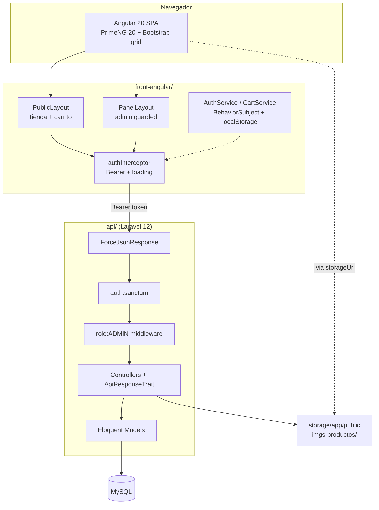
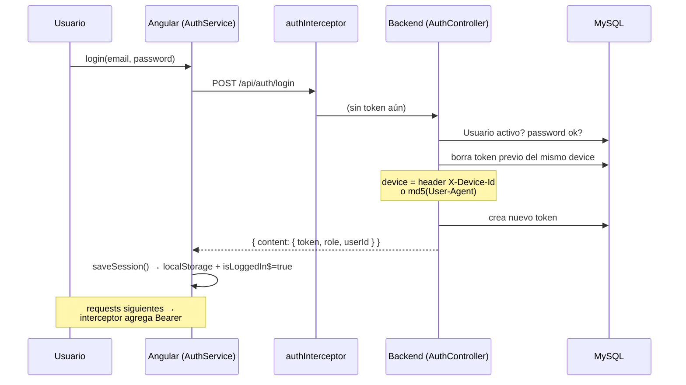
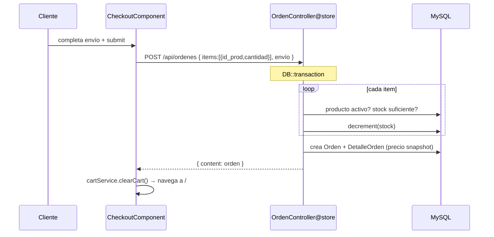

# Codebase Map — Tienda Matecocido

> Auto-generated by Cartographer. Last mapped: 2026-06-14
>
> E-commerce de ceramica artesanal. Monorepo con dos componentes: `api/` (Laravel 12 REST API) y `front-angular/` (Angular 20 SPA). Esquema SQL en `db/`.

## System Overview



**Contrato compartido:** todas las respuestas usan el envelope `{ success, message, content, errors? }` (definido en `ApiResponseTrait`, consumido por los services Angular). El front nunca tipa estas respuestas (`any` en todo el código).

---

## Directory Structure

```
tienda-matecocido/
├── api/                          # Laravel 12 backend (REST API, /api/*)
│   ├── app/
│   │   ├── Enums/Role.php         # ADMIN | CLIENTE (backed enum)
│   │   ├── Http/
│   │   │   ├── Controllers/       # Auth, Producto, Categoria, Color, Orden, Usuario, Health
│   │   │   ├── Middleware/        # ForceJsonResponse, CheckRole
│   │   │   └── Traits/            # ApiResponseTrait (envelope JSON)
│   │   ├── Models/                # BaseModel + 8 modelos de dominio
│   │   └── Providers/             # AppServiceProvider (vacío)
│   ├── bootstrap/app.php          # registro de middleware + exception renderers
│   ├── config/                    # cors (origin localhost:4200), auth (provider=Usuario)
│   ├── database/                  # ⚠ solo migraciones scaffold; dominio vive en db/*.sql
│   ├── routes/api.php             # 29 endpoints
│   └── tests/                     # solo stubs ExampleTest
├── front-angular/                # Angular 20 SPA
│   └── src/app/
│       ├── core/
│       │   ├── guards/            # authGuard, roleGuard
│       │   ├── interceptors/      # authInterceptor
│       │   └── services/          # Auth, Cart, Loading + 5 services de dominio
│       └── features/
│           ├── auth/              # login, registro
│           ├── tienda/            # producto-list, producto-detail
│           ├── cart/              # cart, checkout
│           ├── home/              # landing + destacados
│           ├── dashboard-admin/   # productos, categorias, colores, ordenes, usuarios, resumen
│           ├── layouts/           # PublicLayout, PanelLayout
│           └── common/            # header, footer, spinner, not-found
└── db/                           # schema SQL (fuente real del esquema de dominio)
```

---

## Module Guide — Backend (`api/`)

### Routing & Auth
**Entry**: `routes/api.php` · **Bootstrap**: `bootstrap/app.php`

Pipeline de middleware:
1. `ForceJsonResponse` (prepend global en grupo `api`) — fuerza `Accept: application/json` para que hasta los errores salgan en JSON.
2. `auth:sanctum` — resuelve el usuario por Bearer token.
3. `role:ADMIN` (alias `role` → `CheckRole`) — lee el atributo computado `$user->role` y verifica `in_array`. Debe correr **después** de sanctum.

Exception renderers registrados en `bootstrap/app.php`: `AuthenticationException`→401, `ValidationException`→422 (con `errors`), `QueryException`→500 (mensaje crudo solo en local), `HttpException`→status propio.

### Controllers
**Dir**: `app/Http/Controllers/` · todos usan `ApiResponseTrait` directamente (no hay base controller con lógica).

| Controller | Acciones clave | Notas |
|---|---|---|
| `AuthController` | `registro`, `login`, `logout`, `me`, `cambiarPassword` | device-aware (ver Auth Flow) |
| `ProductoController` | `index` (filtro `?categoria=codigo`), `show` (por `codigo`), `store`/`update`/`destroy` | imágenes + pivots en `DB::transaction` |
| `CategoriaController` | CRUD | `destroy` = soft (`activo=false`) |
| `ColorController` | CRUD | maneja `path_img` como string |
| `OrdenController` | `index`/`show`/`cambiarEstado` (admin), `store`/`misOrdenes` (cliente) | `store` valida stock y hace `decrement()` en transacción |
| `UsuarioController` | `index`, `show`, `toggleActivo` | sin create/delete |
| `HealthController` | `index` | verifica PDO; 503 si falla |

**Validación**: inline con `$request->validate()` — no hay Form Requests. **Serialización**: modelos directos — no hay API Resources (`$hidden=['clave']` en `Usuario` es la única guarda).

### Data Model
**Dir**: `app/Models/` · todos extienden `BaseModel` (vacío) salvo `Usuario` (extiende `Authenticatable` + `HasApiTokens`).

| Modelo | Tabla / PK | Relaciones |
|---|---|---|
| `Usuario` | `usuarios` / `id_usuario` | `hasOne DatosPersonales`, `hasMany Orden`; `getRoleAttribute()` mapea `id_rol`→Role |
| `Producto` | `productos` / `id_prod` | `belongsToMany Categoria`/`Color` (pivots), `hasMany ProductoImagen` |
| `Categoria` | `categorias` / `id_categ` | `belongsToMany Producto` |
| `Color` | `colores` / `id_color` | `belongsToMany Producto`; campo `path_img` |
| `Orden` | `ordenes` / `id_orden` | `belongsTo Usuario`, `hasMany DetalleOrden`; `estado` enum-string |
| `DetalleOrden` | `detalle_ordenes` / `id_detalle` | `belongsTo Orden`/`Producto`; `$timestamps=false`; guarda `precio_unitario` snapshot |
| `DatosPersonales` | `datos_personales` | `belongsTo Usuario` |
| `ProductoImagen` | `productos_imagenes` | `belongsTo Producto`; `path_img` + `nombre` |

Estados de orden: `PENDIENTE`, `CONFIRMADA`, `ENVIADA`, `ENTREGADA`, `CANCELADA`.

---

## Module Guide — Frontend (`front-angular/`)

### Bootstrap & Config
**Entry**: `src/main.ts` → `bootstrapApplication(App, appConfig)` · **Config**: `src/app/app.config.ts`

Providers: `provideZoneChangeDetection({eventCoalescing:true})`, `provideRouter`, `provideHttpClient(withInterceptors([authInterceptor]))`, `provideAnimationsAsync`, `providePrimeNG({theme: Aura, darkModeSelector:false})`. 100% standalone components, lazy loading en todas las páginas.

> ⚠ **Corrección al CLAUDE.md:** el proyecto usa **change detection basado en Zone.js** (`provideZoneChangeDetection` + zone.js 0.15) con `eventCoalescing`, **no es zoneless**. Signals se usan solo en `PanelLayout.sidebarOpen` y `Header.menuOpen`.

### Core (`src/app/core/`)
| Pieza | Archivo | Rol |
|---|---|---|
| `authInterceptor` | `interceptors/auth.interceptor.ts` | inyecta `Bearer`, `loading.show/hide` con ref-count, en 401→`clearSession()`+redirect a login. **No envía X-Device-Id** |
| `authGuard` | `guards/auth.guard.ts` | chequea `isAuthenticated()` sync (localStorage) |
| `roleGuard` | `guards/role.guard.ts` | compara `getUserRole()` contra `route.data.roles` |
| `AuthService` | `services/auth.service.ts` | `isLoggedIn$`/`currentUser$` (BehaviorSubject), keys localStorage: `token`,`role`,`userId` |
| `CartService` | `services/cart.service.ts` | carrito 100% client-side, persiste en `localStorage['cart']`, derivados `total$`/`totalItems$` |
| `LoadingService` | `services/loading.service.ts` | spinner global ref-counted |
| `*Service` (5) | `services/{productos,categorias,colores,ordenes,usuarios}.service.ts` | wrappers HTTP a `${environment.apiUrl}/...` |

### Features
- **Layouts**: `PublicLayout` (header+footer, rutas públicas y auth) vs `PanelLayout` (sidebar admin, rutas `/admin/**`).
- **Tienda (CLIENTE)**: `home`, `producto-list` (reusado para catálogo y `/categoria/:cod`), `producto-detail` (galería), `cart`, `checkout`.
- **Admin (ADMIN)**: `resumen` (stats), `productos` + `producto-form`, `categorias`, `colores`, `ordenes`, `usuarios`. PrimeNG `p-table`/`p-dialog`/`p-select`.

---

## Routing Tables

### Backend — `/api/*` (29 endpoints)

| Método | Path | Controller@Action | Auth |
|---|---|---|---|
| GET | `/health` | `HealthController@index` | público |
| GET | `/productos` | `ProductoController@index` | público |
| GET | `/productos/{codigo}` | `ProductoController@show` | público |
| GET | `/categorias` | `CategoriaController@index` | público |
| GET | `/colores` | `ColorController@index` | público |
| POST | `/auth/registro` | `AuthController@registro` | público |
| POST | `/auth/login` | `AuthController@login` | público |
| POST | `/auth/logout` | `AuthController@logout` | sanctum |
| GET | `/auth/me` | `AuthController@me` | sanctum |
| PUT | `/auth/cambiar-password` | `AuthController@cambiarPassword` | sanctum |
| POST | `/ordenes` | `OrdenController@store` | sanctum |
| GET | `/ordenes/mis-ordenes` | `OrdenController@misOrdenes` | sanctum |
| POST/PUT/DELETE | `/productos`, `/productos/{id}` | `ProductoController@store/update/destroy` | sanctum + ADMIN |
| GET/POST/PUT/DELETE | `/categorias`, `/categorias/{id}` | `CategoriaController` (show/store/update/destroy) | sanctum + ADMIN |
| GET/POST/PUT/DELETE | `/colores`, `/colores/{id}` | `ColorController` (show/store/update/destroy) | sanctum + ADMIN |
| GET | `/usuarios`, `/usuarios/{id}` | `UsuarioController@index/show` | sanctum + ADMIN |
| PUT | `/usuarios/{id}/toggle-activo` | `UsuarioController@toggleActivo` | sanctum + ADMIN |
| GET | `/ordenes`, `/ordenes/{id}` | `OrdenController@index/show` | sanctum + ADMIN |
| PUT | `/ordenes/{id}/estado` | `OrdenController@cambiarEstado` | sanctum + ADMIN |

### Frontend (todas lazy)

| Path | Component | Layout | Guards |
|---|---|---|---|
| `/` | `HomeComponent` | Public | — |
| `/tienda` · `/tienda/categoria/:codCateg` | `ProductoListComponent` | Public | — |
| `/tienda/producto/:codProd` | `ProductoDetailComponent` | Public | — |
| `/cart` | `CartComponent` | Public | — |
| `/checkout` | `CheckoutComponent` | Public | — (chequeo soft en template) |
| `/auth/login` · `/auth/registro` | `Login`/`RegisterComponent` | Public | — |
| `/admin` → `/admin/resumen` | `ResumenComponent` | Panel | `authGuard` + `roleGuard(ADMIN)` |
| `/admin/{productos,categorias,colores,ordenes,usuarios}` | respectivos | Panel | heredados |
| `/admin/productos/{nuevo,editar/:codProd}` | `ProductoFormComponent` | Panel | heredados |
| `**` | `NotFoundComponent` | — | — |

---

## Data Flow

### Auth (login device-aware + token)



### Checkout (crear orden)



---

## Conventions

| Tema | Convención |
|---|---|
| Envelope API | `{ success, message, content, errors? }` (ApiResponseTrait) |
| Soft delete | manual vía `activo=false` (no se usa el trait `SoftDeletes`) |
| PKs | nombres de dominio: `id_prod`, `id_categ`, `id_color`, `id_usuario`, `id_orden` |
| Lookup producto | público por `codigo` (slug); admin update/delete por `id` (PK) |
| Validación back | inline `$request->validate()` (sin Form Requests) |
| Forms front | template-driven (`FormsModule` + `ngModel`); no hay Reactive Forms |
| Componentes front | standalone, lazy, signals mínimos, estado vía BehaviorSubject |
| Imágenes | back guarda en `imgs-productos/{codigo}/`; front arma URL `${storageUrl}/${path_img}` |
| Confirmaciones | `confirm()` nativo del navegador (no ConfirmDialog de PrimeNG) |
| Errores UI | inline en el form (no hay Toast/MessageService) |
| Moneda | pipe `'ARS':'symbol':'1.0-0'` (sin decimales) |
| CORS | origin default `http://localhost:4200`, `supports_credentials:false` (token-only) |

---

## Gotchas

**Backend**
1. **`Usuario::rol()` apunta a `RolModel` inexistente** — explota si se llama; el código usa el atributo computado `role` en su lugar.
2. **One-token-per-device**: login borra el token previo del mismo device (`X-Device-Id` o `md5(User-Agent)`). Sin `X-Device-Id`, dos pestañas del mismo browser comparten device → re-login invalida la sesión anterior. **El front NO envía `X-Device-Id`**, así que cae al fallback por User-Agent.
3. **`getAuthPassword()` devuelve `clave`**, no `password`.
4. **`noContentResponse` devuelve 200** (con body), no 204.
5. **Sin migraciones de dominio**: `database/migrations/` solo tiene scaffold; el esquema real vive en `db/*.sql`. No reproducible con `artisan migrate`.
6. **`update()` de productos solo agrega imágenes**, nunca borra las viejas (ni registros ni archivos). Usa el `getClientOriginalName()` sin sanitizar → colisiones posibles.
7. **Stock check-then-decrement no tiene lock**: posible overselling en concurrencia (cada `decrement()` es atómico, el patrón completo no).
8. **Usuario desactivado tras login conserva su token** hasta logout (no hay re-chequeo de `activo` en middleware).
9. **Sin tests de dominio** ni factories/seeders reales (solo el `User` scaffold por defecto).

**Frontend**
10. **No existe "Mis Órdenes"**: `OrdenesService.getMisOrdenes()` y `AuthService.getMe()` están definidos pero **nunca se llaman** → no hay historial de cliente ni se carga el perfil tras login (`currentUser$` siempre `null`).
11. **`/checkout` sin guard**: cualquiera entra; el back rechaza con 401 (interceptor desloguea), pero no hay redirect a nivel de ruta.
12. **Edición de producto no gestiona imágenes existentes** (solo agrega).
13. **`Header.userRole` se lee una vez en construcción** desde localStorage → no reacciona a cambios de rol sin reload (el logout hace `window.location.href='/'`, que recarga).
14. **`ColoresComponent` no expone `path_img`** aunque el service lo soporta.
15. **`ProductosService.update` envía POST** (no PUT) a `/productos/:id` — el back lo maneja como POST.
16. **Respuestas API tipadas como `any`** en todo el front (no hay interfaces de modelo).

---

## Navigation Guide

**Agregar un endpoint nuevo (back)**:
1. `routes/api.php` (grupo correcto: público / sanctum / admin)
2. método en el Controller correspondiente (`app/Http/Controllers/`)
3. usar helpers de `ApiResponseTrait` para responder
4. si toca tablas nuevas → actualizar `db/*.sql` (no hay migraciones de dominio)

**Consumir ese endpoint (front)**:
1. agregar método al `*Service` correspondiente en `core/services/`
2. inyectar el service en el componente feature
3. recordar el envelope `{ content }` al mapear la respuesta

**Agregar una página de cliente**:
1. crear componente standalone en `features/tienda/` (o donde corresponda)
2. registrar ruta lazy en `app.routes.ts` bajo `PublicLayout`

**Agregar una sección de admin**:
1. componente en `features/dashboard-admin/`
2. ruta lazy bajo `/admin` (hereda `authGuard`+`roleGuard`)
3. agregar link en `PanelLayoutComponent`

**Tocar auth/roles**:
- back: `AuthController`, `CheckRole` middleware, `Enums/Role.php`, `bootstrap/app.php` (alias + renderers)
- front: `AuthService`, `authInterceptor`, `authGuard`/`roleGuard`

**Manejo de imágenes de producto**:
- back: `ProductoController@store/update` (disk `public`, dir `imgs-productos/{codigo}/`), `Config/filesystems.php`, requiere `artisan storage:link`
- front: `ProductoFormComponent` (FormData `imagenes[]`), URL armada con `environment.storageUrl`

---

*Si Cartographer te sirvió, considerá darle una estrella: https://github.com/kingbootoshi/cartographer*
