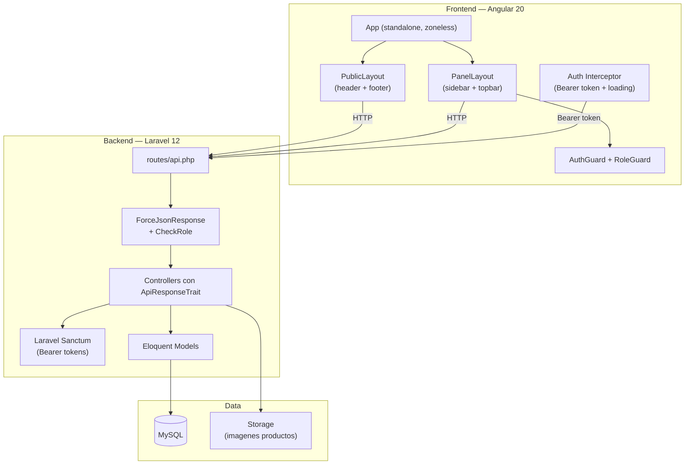

# Plan de Migracion — Tienda Matecocido

> Migrar la estructura del proyecto para alinearse con la arquitectura de **project-mitaller** (Laravel 12 + Angular 20), adaptada al dominio e-commerce con roles ADMIN y CLIENTE.

## Arquitectura Objetivo (basada en project-mitaller)



## Resumen de Cambios

| Componente | Estado Actual | Estado Objetivo |
|---|---|---|
| **Backend framework** | Slim 4 + Eloquent standalone | Laravel 12 + Eloquent nativo |
| **Auth backend** | JWT manual (firebase/php-jwt), sin middleware | Laravel Sanctum (Bearer tokens, expiracion) |
| **Passwords** | SHA-512 sin salt | `Hash::make()` (bcrypt) |
| **Respuestas API** | `GenericResponse::obtain()` string | `ApiResponseTrait` (envelope uniforme) |
| **Roles** | Enum no usado, hardcoded `id_rol=2` | Enum PHP `Role` + middleware `CheckRole` |
| **Rutas** | En `index.php` monolitico | `routes/api.php` con grupos y middleware |
| **Config DB** | Credenciales hardcoded | `.env` + `config/database.php` Laravel |
| **CORS** | `.htaccess` con `*` | `config/cors.php` con `CORS_ALLOWED_ORIGINS` de `.env` |
| **Frontend** | React 18 + Firebase Auth/Firestore | Angular 20 standalone + Sanctum REST |
| **UI Library** | Bootstrap 5 + React-Bootstrap | PrimeNG 20 + Bootstrap 5 grid |
| **State** | React Context (CartContext, AuthContext) | Angular Services + BehaviorSubject/Signals |
| **Frontend Auth** | Firebase Auth (Google + email) | REST API auth (Sanctum tokens en localStorage) |
| **Orders** | Firestore | MySQL (nueva tabla `ordenes` + `detalle_ordenes`) |
| **Cart** | useState sin persistencia | Service con BehaviorSubject + localStorage |

---

## FASE 1: Backend — Migrar de Slim 4 a Laravel 12

### 1.1 Crear proyecto Laravel 12

```bash
# En una carpeta temporal o nueva rama
composer create-project laravel/laravel tienda-matecocido-api
```

**Estructura objetivo:**
```
tienda-matecocido-api/          # (reemplaza api/)
├── app/
│   ├── Enums/
│   │   └── Role.php                    # enum Role: string { ADMIN, CLIENTE }
│   ├── Http/
│   │   ├── Controllers/
│   │   │   ├── Controller.php          # Base abstracto
│   │   │   ├── AuthController.php      # registro, login, logout, me, cambiarPassword
│   │   │   ├── ProductoController.php  # CRUD productos + imagenes
│   │   │   ├── CategoriaController.php # CRUD categorias
│   │   │   ├── ColorController.php     # CRUD colores
│   │   │   ├── UsuarioController.php   # CRUD usuarios (admin)
│   │   │   ├── OrdenController.php     # Crear orden, listar, detalle
│   │   │   ├── CarritoController.php   # (opcional: carrito server-side)
│   │   │   └── HealthController.php    # DB liveness check
│   │   ├── Middleware/
│   │   │   ├── ForceJsonResponse.php   # Force Accept: application/json
│   │   │   └── CheckRole.php          # Verifica rol del usuario
│   │   └── Traits/
│   │       └── ApiResponseTrait.php    # Envelope uniforme JSON
│   └── Models/
│       ├── Usuario.php                 # HasApiTokens (Sanctum)
│       ├── Producto.php
│       ├── Categoria.php
│       ├── Color.php
│       ├── ProductoImagen.php
│       ├── Orden.php                   # NUEVO
│       ├── DetalleOrden.php            # NUEVO
│       └── DatosPersonales.php         # NUEVO (activar modelo existente en DB)
├── bootstrap/
│   └── app.php                         # Middleware + exception handlers
├── config/
│   ├── cors.php
│   └── sanctum.php
├── routes/
│   └── api.php                         # Todas las rutas REST
├── database/
│   └── seeders/
├── deploy/                             # Scripts de deploy (como mitaller)
├── postman/
├── tienda_matecocido.sql               # DDL fuente de verdad
├── .env / .env.example / .env.production
└── CLAUDE.md
```

### 1.2 Migrar Modelos Eloquent

Portar modelos desde `api/src/Models/` a `app/Models/`:

| Modelo Actual | Modelo Laravel | Cambios |
|---|---|---|
| `Producto.php` | `Producto.php` | Agregar `HasApiTokens` trait, fix relaciones, agregar `$casts` |
| `Categoria.php` | `Categoria.php` | Sin cambios mayores |
| `Color.php` | `Color.php` | Sin cambios mayores |
| `ProductoCategoria.php` | Eliminar | Usar `belongsToMany` con pivot nativo |
| `ProductoColor.php` | Eliminar | Usar `belongsToMany` con pivot nativo, fix FK bug |
| `ProductoImagen.php` | `ProductoImagen.php` | Sin cambios mayores |
| `Usuario.php` | `Usuario.php` | Agregar `HasApiTokens`, usar `Hash::make()`, agregar relacion a `DatosPersonales` |
| — | `Orden.php` | **NUEVO**: ordenes de compra |
| — | `DetalleOrden.php` | **NUEVO**: items de cada orden |
| — | `DatosPersonales.php` | **NUEVO**: tabla ya existe en DB |

### 1.3 Implementar Auth con Sanctum

Siguiendo el patron de project-mitaller:

```php
// routes/api.php
Route::post('/auth/registro', [AuthController::class, 'registro']);
Route::post('/auth/login', [AuthController::class, 'login']);

Route::middleware('auth:sanctum')->group(function () {
    Route::post('/auth/logout', [AuthController::class, 'logout']);
    Route::get('/auth/me', [AuthController::class, 'me']);
    Route::put('/auth/cambiar-password', [AuthController::class, 'cambiarPassword']);

    // Rutas de CLIENTE
    Route::post('/ordenes', [OrdenController::class, 'store']);
    Route::get('/ordenes/mis-ordenes', [OrdenController::class, 'misOrdenes']);

    // Rutas de ADMIN
    Route::middleware('role:ADMIN')->group(function () {
        // CRUD productos, categorias, colores, usuarios, ordenes
        Route::apiResource('productos', ProductoController::class);
        Route::apiResource('categorias', CategoriaController::class);
        Route::apiResource('colores', ColorController::class);
        Route::get('/usuarios', [UsuarioController::class, 'index']);
        Route::get('/ordenes', [OrdenController::class, 'index']);
    });
});

// Publicas (sin auth)
Route::get('/health', [HealthController::class, 'index']);
Route::get('/productos', [ProductoController::class, 'index']);
Route::get('/productos/{codigo}', [ProductoController::class, 'show']);
Route::get('/categorias', [CategoriaController::class, 'index']);
Route::get('/colores', [ColorController::class, 'index']);
```

### 1.4 ApiResponseTrait (copiar patron de mitaller)

```php
trait ApiResponseTrait {
    protected function successResponse($content, $message = 'OK', $code = 200) {
        return response()->json([
            'success' => true,
            'message' => $message,
            'content' => $content,
        ], $code);
    }
    // + createdResponse, errorResponse, notFoundResponse, validationErrorResponse
}
```

### 1.5 Actualizar Schema de DB

Agregar tablas nuevas al SQL:

```sql
-- Ordenes de compra
CREATE TABLE ordenes (
    id_orden INT AUTO_INCREMENT PRIMARY KEY,
    id_usuario INT NOT NULL,
    total DECIMAL(10,2) NOT NULL,
    estado ENUM('PENDIENTE', 'CONFIRMADA', 'ENVIADA', 'ENTREGADA', 'CANCELADA') DEFAULT 'PENDIENTE',
    datos_envio JSON,  -- nombre, direccion, telefono, email
    activo TINYINT(1) DEFAULT 1,
    created_at TIMESTAMP DEFAULT CURRENT_TIMESTAMP,
    updated_at TIMESTAMP DEFAULT CURRENT_TIMESTAMP ON UPDATE CURRENT_TIMESTAMP,
    FOREIGN KEY (id_usuario) REFERENCES usuarios(id_usuario)
);

-- Detalle de cada orden
CREATE TABLE detalle_ordenes (
    id_detalle INT AUTO_INCREMENT PRIMARY KEY,
    id_orden INT NOT NULL,
    id_prod INT NOT NULL,
    cantidad INT NOT NULL,
    precio_unitario DECIMAL(10,2) NOT NULL,
    subtotal DECIMAL(10,2) NOT NULL,
    created_at TIMESTAMP DEFAULT CURRENT_TIMESTAMP,
    FOREIGN KEY (id_orden) REFERENCES ordenes(id_orden),
    FOREIGN KEY (id_prod) REFERENCES productos(id_prod)
);

-- Agregar FK faltantes en tablas pivot
ALTER TABLE productos_categorias
    ADD FOREIGN KEY (id_prod) REFERENCES productos(id_prod),
    ADD FOREIGN KEY (id_categ) REFERENCES categorias(id_categ);

ALTER TABLE productos_colores
    ADD FOREIGN KEY (id_prod) REFERENCES productos(id_prod),
    ADD FOREIGN KEY (id_color) REFERENCES colores(id_color);

-- Cambiar precio de INT a DECIMAL
ALTER TABLE productos MODIFY precio DECIMAL(10,2) NOT NULL;
```

### 1.6 Migrar Logica de Upload de Imagenes

Usar Laravel Storage en vez de paths relativos:

```php
// En ProductoController
$path = $request->file('imagen')->store('productos/' . $producto->codigo, 'public');
```

### 1.7 Configuracion CORS y Middleware

En `bootstrap/app.php` (como mitaller):
```php
->withMiddleware(function (Middleware $middleware) {
    $middleware->api(prepend: [ForceJsonResponse::class]);
    $middleware->alias(['role' => CheckRole::class]);
})
```

En `config/cors.php`:
```php
'allowed_origins' => explode(',', env('CORS_ALLOWED_ORIGINS', 'http://localhost:4200')),
```

---

## FASE 2: Frontend — Migrar de React a Angular 20

### 2.1 Crear proyecto Angular 20 nuevo (reemplaza front-angular/)

```bash
ng new tienda-matecocido --style=scss --routing --ssr=false
```

Instalar dependencias:
```bash
npm install primeng primeicons primeflex bootstrap @angular/cdk
```

### 2.2 Estructura objetivo del frontend

```
tienda-matecocido/               # (reemplaza front-angular/)
├── src/
│   ├── app/
│   │   ├── app.ts                      # Root component (standalone)
│   │   ├── app.config.ts               # Providers: zoneless, router, HttpClient, PrimeNG
│   │   ├── app.routes.ts               # Root routes (lazy-loaded)
│   │   │
│   │   ├── core/                       # Servicios singleton, guards, interceptors
│   │   │   ├── guards/
│   │   │   │   ├── auth.guard.ts       # Verifica token en localStorage
│   │   │   │   └── role.guard.ts       # Verifica rol contra route.data['roles']
│   │   │   ├── interceptors/
│   │   │   │   └── auth.interceptor.ts # Bearer token + loading + 401 redirect
│   │   │   └── services/
│   │   │       ├── auth.service.ts     # Login, registro, logout, me, session
│   │   │       ├── productos.service.ts
│   │   │       ├── categorias.service.ts
│   │   │       ├── colores.service.ts
│   │   │       ├── ordenes.service.ts
│   │   │       ├── usuarios.service.ts
│   │   │       ├── cart.service.ts     # BehaviorSubject<CartItem[]> + localStorage
│   │   │       └── loading.service.ts  # Spinner de carga
│   │   │
│   │   └── features/                   # Modulos por feature (lazy-loaded)
│   │       ├── auth/
│   │       │   ├── auth.routes.ts
│   │       │   └── pages/
│   │       │       ├── login/
│   │       │       └── register/
│   │       ├── common/
│   │       │   ├── header/             # Navbar publica con categorias + cart widget
│   │       │   ├── footer/
│   │       │   ├── spinner/
│   │       │   └── not-found/
│   │       ├── layouts/
│   │       │   ├── public-layout/      # Header + Footer wrapper
│   │       │   └── panel-layout/       # Sidebar + Topbar wrapper (admin)
│   │       ├── home/
│   │       │   └── home/               # Landing page con productos destacados
│   │       ├── tienda/
│   │       │   ├── producto-list/      # Grilla de productos (con filtro por categoria)
│   │       │   └── producto-detail/    # Detalle + agregar al carrito
│   │       ├── cart/
│   │       │   ├── cart/               # Vista del carrito
│   │       │   └── checkout/           # Formulario de compra + resumen
│   │       ├── dashboard-admin/
│   │       │   ├── resumen/            # Panel de control
│   │       │   ├── productos/
│   │       │   │   ├── productos.component.*      # Tabla de productos
│   │       │   │   └── producto-form/              # ABM productos
│   │       │   ├── categorias/         # ABM categorias
│   │       │   ├── colores/            # ABM colores
│   │       │   ├── ordenes/            # Lista y detalle de ordenes
│   │       │   └── usuarios/           # Lista usuarios
│   │       └── mi-cuenta/
│   │           ├── mi-cuenta.routes.ts
│   │           ├── perfil/
│   │           └── cambiar-password/
│   │
│   ├── environments/
│   │   ├── environment.ts              # Dev: apiUrl = 'http://localhost:8000'
│   │   └── environment.prod.ts         # Prod: apiUrl del servidor
│   ├── styles/
│   │   └── _variables.scss             # Design tokens centralizados
│   └── styles.scss                     # Global + PrimeNG overrides
├── angular.json
├── package.json
└── CLAUDE.md
```

### 2.3 Routing (siguiendo patron mitaller)

```typescript
// app.routes.ts
export const routes: Routes = [
  // === RUTAS PUBLICAS ===
  {
    path: '',
    component: PublicLayoutComponent,
    children: [
      { path: '', loadComponent: () => import('./features/home/home/home.component').then(m => m.HomeComponent) },
      { path: 'tienda', loadComponent: () => import('./features/tienda/producto-list/producto-list.component').then(m => m.ProductoListComponent) },
      { path: 'tienda/categoria/:codCateg', loadComponent: () => import('./features/tienda/producto-list/producto-list.component').then(m => m.ProductoListComponent) },
      { path: 'tienda/producto/:codProd', loadComponent: () => import('./features/tienda/producto-detail/producto-detail.component').then(m => m.ProductoDetailComponent) },
      { path: 'cart', loadComponent: () => import('./features/cart/cart/cart.component').then(m => m.CartComponent) },
      { path: 'checkout', loadComponent: () => import('./features/cart/checkout/checkout.component').then(m => m.CheckoutComponent) },
    ]
  },
  // === AUTH ===
  {
    path: 'auth',
    loadChildren: () => import('./features/auth/auth.routes').then(m => m.default)
  },
  // === ADMIN ===
  {
    path: 'admin',
    component: PanelLayoutComponent,
    canActivate: [AuthGuard, RoleGuard],
    data: { roles: ['ADMIN'] },
    children: [
      { path: '', redirectTo: 'resumen', pathMatch: 'full' },
      { path: 'resumen', loadComponent: () => import('./features/dashboard-admin/resumen/resumen.component').then(m => m.ResumenComponent) },
      { path: 'productos', loadComponent: () => import('./features/dashboard-admin/productos/productos.component').then(m => m.ProductosComponent) },
      { path: 'productos/nuevo', loadComponent: () => import('./features/dashboard-admin/productos/producto-form/producto-form.component').then(m => m.ProductoFormComponent) },
      { path: 'productos/editar/:codProd', loadComponent: () => import('./features/dashboard-admin/productos/producto-form/producto-form.component').then(m => m.ProductoFormComponent) },
      { path: 'categorias', loadComponent: () => import('./features/dashboard-admin/categorias/categorias.component').then(m => m.CategoriasComponent) },
      { path: 'colores', loadComponent: () => import('./features/dashboard-admin/colores/colores.component').then(m => m.ColoresComponent) },
      { path: 'ordenes', loadComponent: () => import('./features/dashboard-admin/ordenes/ordenes.component').then(m => m.OrdenesComponent) },
      { path: 'usuarios', loadComponent: () => import('./features/dashboard-admin/usuarios/usuarios.component').then(m => m.UsuariosComponent) },
      { path: 'mi-cuenta', loadChildren: () => import('./features/mi-cuenta/mi-cuenta.routes').then(m => m.default) },
    ]
  },
  // === MI CUENTA (CLIENTE) ===
  {
    path: 'mi-cuenta',
    component: PublicLayoutComponent,
    canActivate: [AuthGuard],
    loadChildren: () => import('./features/mi-cuenta/mi-cuenta.routes').then(m => m.default)
  },
  { path: '**', loadComponent: () => import('./features/common/not-found/not-found.component').then(m => m.NotFoundComponent) }
];
```

### 2.4 Servicios Core

#### AuthService (patron mitaller)
```typescript
@Injectable({ providedIn: 'root' })
export class AuthService {
  private isLoggedIn$ = new BehaviorSubject<boolean>(!!localStorage.getItem('token'));
  private currentUser$ = new BehaviorSubject<any>(null);

  login(email: string, password: string): Observable<any> { ... }
  registro(data: any): Observable<any> { ... }
  logout(): Observable<any> { ... }
  getMe(): Observable<any> { ... }
  saveSession(token: string, role: string, userId: number): void { ... }
  clearSession(): void { ... }
  getToken(): string | null { return localStorage.getItem('token'); }
  getUserRole(): string | null { return localStorage.getItem('role'); }
  isAuthenticated(): boolean { return !!this.getToken(); }
}
```

#### CartService (reemplaza React CartContext)
```typescript
@Injectable({ providedIn: 'root' })
export class CartService {
  private cart$ = new BehaviorSubject<CartItem[]>(this.loadFromStorage());

  items$ = this.cart$.asObservable();
  total$ = this.cart$.pipe(map(items => items.reduce((sum, i) => sum + i.precio * i.cantidad, 0)));
  totalItems$ = this.cart$.pipe(map(items => items.reduce((sum, i) => sum + i.cantidad, 0)));

  addItem(item: CartItem): void { ... }       // Agrega o incrementa cantidad
  removeItem(codigo: string): void { ... }
  updateQuantity(codigo: string, qty: number): void { ... }
  clearCart(): void { ... }

  private saveToStorage(): void { localStorage.setItem('cart', JSON.stringify(this.cart$.value)); }
  private loadFromStorage(): CartItem[] { ... }
}
```

### 2.5 Auth Interceptor (patron mitaller)

```typescript
export const authInterceptor: HttpInterceptorFn = (req, next) => {
  const authService = inject(AuthService);
  const loadingService = inject(LoadingService);
  const router = inject(Router);

  const publicUrls = ['/auth/login', '/auth/registro', '/productos', '/categorias', '/colores'];
  const isPublic = publicUrls.some(url => req.url.includes(url)) && req.method === 'GET';

  loadingService.show();

  if (!isPublic) {
    const token = authService.getToken();
    if (token) {
      req = req.clone({ setHeaders: { Authorization: `Bearer ${token}` } });
    }
  }

  return next(req).pipe(
    catchError(err => {
      if (err.status === 401) {
        authService.clearSession();
        router.navigate(['/auth/login']);
      }
      return throwError(() => err);
    }),
    finalize(() => loadingService.hide())
  );
};
```

### 2.6 Layouts (patron mitaller)

- **PublicLayoutComponent**: `<app-header>` + `<router-outlet>` + `<app-footer>` (tienda publica)
- **PanelLayoutComponent**: Sidebar con menu admin + topbar con usuario + `<router-outlet>` (backoffice)

### 2.7 UI con PrimeNG

Reemplazar React-Bootstrap por PrimeNG:
- **Tablas**: `p-table` (reemplaza `TableRender` custom)
- **Formularios**: `p-inputText`, `p-inputNumber`, `p-select`, `p-fileUpload`
- **Botones**: `p-button` con clases custom
- **Notificaciones**: `MessageService` + `p-toast` (reemplaza SweetAlert2)
- **Dialogs**: `p-confirmDialog` (reemplaza `modalDelete`)
- **Cards**: `p-card` para producto grid
- **Carousel**: `p-carousel` o `p-galleria` para imagenes de producto

---

## FASE 3: Eliminar Codigo Legacy

### 3.1 Eliminar carpeta `front/` (React)
- Todo el frontend React queda obsoleto al completar el Angular
- Firebase Auth y Firestore ya no se necesitan

### 3.2 Eliminar carpeta `api/` (Slim 4)
- Reemplazada por `tienda-matecocido-api/` (Laravel 12)
- O renombrar el nuevo proyecto para que viva en la misma estructura

### 3.3 Limpiar rama `front` (branch con React)
- Puede archivarse como tag antes de eliminar

---

## FASE 4: Integracion y Deploy

### 4.1 Estructura final del repo

```
tienda-matecocido/
├── tienda-matecocido-api/    # Laravel 12 backend
├── tienda-matecocido/        # Angular 20 frontend
├── db/                        # SQL schema
├── postman/                   # Coleccion Postman actualizada
├── CLAUDE.md
└── docs/
    ├── CODEBASE_MAP.md
    └── PLAN_MIGRACION.md
```

### 4.2 Deploy (siguiendo patron mitaller con Hostinger)

**API (Hostinger site 1):**
```
/home/u{ID}/
├── tienda-matecocido-api/    # Laravel completo
└── public_html/
    ├── index.php              # Bridge a Laravel
    └── .htaccess
```

**Frontend (Hostinger site 2 o subfolder):**
```
public_html/
├── index.html                 # Angular build
├── *.js, *.css
└── .htaccess                  # SPA rewrite
```

---

## Orden de Implementacion Sugerido

### Sprint 1 — Backend Base (Laravel)
1. [ ] Crear proyecto Laravel 12
2. [ ] Configurar Sanctum, CORS, middleware (ForceJsonResponse, CheckRole)
3. [ ] Implementar ApiResponseTrait
4. [ ] Crear Enum Role (ADMIN, CLIENTE)
5. [ ] Portar modelos: Usuario, Producto, Categoria, Color, ProductoImagen
6. [ ] Implementar AuthController (registro, login, logout, me, cambiarPassword)
7. [ ] Implementar ProductoController (CRUD + imagenes)
8. [ ] Implementar CategoriaController y ColorController
9. [ ] Actualizar SQL: agregar tablas ordenes, detalle_ordenes, FKs
10. [ ] Testear con Postman

### Sprint 2 — Backend Completo
11. [ ] Implementar OrdenController (crear orden, listar, detalle, cambiar estado)
12. [ ] Implementar UsuarioController (CRUD admin)
13. [ ] Implementar DatosPersonalesController (perfil del cliente)
14. [ ] Implementar HealthController
15. [ ] Validaciones completas en todos los controllers
16. [ ] Testear todos los endpoints con Postman

### Sprint 3 — Frontend Base (Angular)
17. [ ] Crear proyecto Angular 20 (standalone, zoneless, SCSS)
18. [ ] Instalar PrimeNG, Bootstrap 5, PrimeFlex
19. [ ] Configurar environments (dev/prod)
20. [ ] Implementar core: AuthService, CartService, LoadingService
21. [ ] Implementar auth.interceptor.ts
22. [ ] Implementar guards (AuthGuard, RoleGuard)
23. [ ] Implementar layouts (PublicLayout, PanelLayout)
24. [ ] Implementar common: Header (con categorias + cart widget), Footer, Spinner, NotFound

### Sprint 4 — Frontend Tienda Publica
25. [ ] HomeComponent (landing con productos destacados)
26. [ ] ProductoListComponent (grilla con filtro por categoria)
27. [ ] ProductoDetailComponent (detalle + agregar al carrito)
28. [ ] CartComponent (vista carrito con cantidades editables)
29. [ ] CheckoutComponent (form datos envio + resumen + confirmar)
30. [ ] Login y Register pages
31. [ ] MiCuenta: perfil y cambiar password

### Sprint 5 — Frontend Admin
32. [ ] ResumenComponent (dashboard con metricas basicas)
33. [ ] ProductosComponent (tabla con PrimeNG p-table)
34. [ ] ProductoFormComponent (ABM con upload de imagenes)
35. [ ] CategoriasComponent (ABM)
36. [ ] ColoresComponent (ABM)
37. [ ] OrdenesComponent (lista + detalle + cambiar estado)
38. [ ] UsuariosComponent (lista)

### Sprint 6 — Limpieza y Deploy
39. [ ] Eliminar front/ (React)
40. [ ] Eliminar api/ (Slim 4)
41. [ ] Actualizar CLAUDE.md y CODEBASE_MAP.md
42. [ ] Preparar deploy Hostinger (scripts en deploy/)
43. [ ] Configurar CORS para dominio de produccion
44. [ ] Deploy y testing en produccion

---

## Mapeo de Funcionalidad: React -> Angular

| Funcionalidad React | Componente/Servicio Angular |
|---|---|
| `AuthContext.js` (Firebase Auth) | `core/services/auth.service.ts` (Sanctum REST) |
| `CartContext.js` | `core/services/cart.service.ts` (BehaviorSubject + localStorage) |
| `useAsync.js` hook | RxJS en servicios (`switchMap`, `catchError`) |
| `NotificationService.js` (SweetAlert2) | PrimeNG `MessageService` + `p-toast` |
| `AppRouter.js` | `app.routes.ts` (lazy-loaded) |
| `Dashboard-guard.js` (vacio) | `core/guards/auth.guard.ts` + `role.guard.ts` |
| `Navbar.js` | `features/common/header/header.component.ts` |
| `Footer.js` | `features/common/footer/footer.component.ts` |
| `Item.js` / `ItemList.js` / `ItemListContainer.js` | `features/tienda/producto-list/` |
| `ItemDetail.js` / `ItemDetailContainer.js` | `features/tienda/producto-detail/` |
| `CartContainer.js` / `CartDetail.js` / `CartItem.js` | `features/cart/cart/` |
| `Checkout.js` / `FormCheckout.js` / `DetailCheckout.js` | `features/cart/checkout/` |
| `Login.js` | `features/auth/pages/login/` |
| `Dashboard.js` | `features/dashboard-admin/resumen/` |
| `ProductsPrincipal.js` | `features/dashboard-admin/productos/` |
| `AbmProducts.js` | `features/dashboard-admin/productos/producto-form/` |
| `TableRender/` (custom) | PrimeNG `p-table` |
| `SideBarDashboard.js` | `features/layouts/panel-layout/` (sidebar integrado) |
| `services/firebase/*` | Eliminados — todo via REST + Angular HttpClient |
| `adapters/productAdapter.js` | TypeScript interfaces en `core/models/` |

---

## Decisiones Arquitectonicas

1. **Sin Firebase**: Todo se migra a REST API + MySQL. Auth via Sanctum tokens.
2. **Sin NgModules**: Standalone components como en mitaller (Angular 20).
3. **Zoneless**: `provideZonelessChangeDetection()` como en mitaller.
4. **PrimeNG**: UI library principal (no Material, no React-Bootstrap).
5. **Precio DECIMAL**: Cambiar de INT a DECIMAL(10,2) para soportar centavos.
6. **Cart con persistencia**: localStorage para no perder carrito al refrescar.
7. **Ordenes en MySQL**: No Firestore. Tabla `ordenes` + `detalle_ordenes`.
8. **Soft deletes**: `activo` flag como en mitaller, nunca hard delete.
9. **SQL como fuente de verdad**: Sin Laravel migrations para tablas de dominio.
